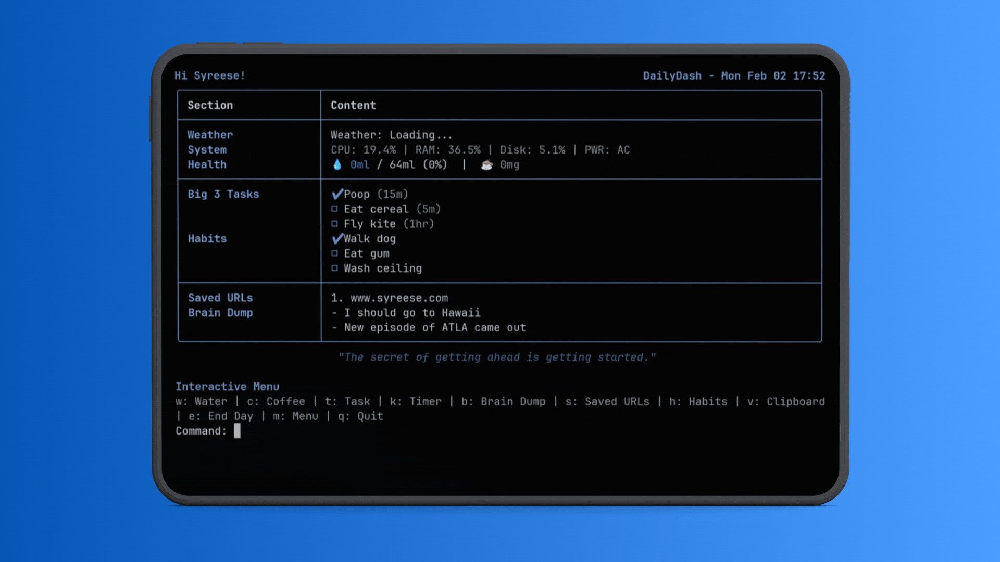

# DailyDash



> **Terminal-based Head-Up Display (HUD) for focus-driven developers.**

**DailyDash** combines essential productivity tools—Task Management, Pomodoro Timer, Water Tracking, and Ambient Noise—into a single, blazing-fast TUI that stays out of your way.

---

## Features

### 🖥️ Dashboard
Visualizes your day at a glance.
-   **Grouped Layout**: Intelligently grouped sections (Overview / action / Storage).
-   **Weather & System**: Real-time local weather and system vitals (CPU/RAM).
-   **Health**: Track water intake and caffeine consumption.

### 🎯 Focus Tools
-   **Big 3 Tasks**: Limit your daily task list to the 3 most important items.
-   **Pomodoro Timer**: Non-blocking timer with desktop notifications.
-   **Ambient Noise**: Built-in Brown Noise generator for deep work.
-   **Eye Strain Reminder**: 20-20-20 rule notifications.

### 🛠️ Utilities
-   **Clipboard Manager**: Automatically tracks your last 10 copied items.
-   **Brain Dump**: Quick-capture notepad for distracting thoughts.
-   **Parking Lot**: Fast URL saver for later reading.

### 🎨 Personalization
-   **Color Schemes**: 5 Built-in themes (Default, Ocean, Sunset, Forest, Monochrome) using Hex colors for reliable styling across any terminal.
-   **Cross-Platform**: Works seamlessly on **Linux**, **Windows**, and **macOS**.

---

## Installation

### Arch Linux (AUR)
Install using your favorite AUR helper (e.g., `yay`):
```bash
yay -S dailydash
```

### Manual Installation (All Platforms)

1.  **Clone the repository**:
    ```bash
    git clone https://github.com/SyreeseOfficial/DailyDash.git
    cd DailyDash
    ```

2.  **Install**:
    ```bash
    # This installs dependencies and the 'dailydash' command
    pip3 install .
    ```

    *If you prefer a virtual environment (recommended):*
    ```bash
    python3 -m venv venv
    source venv/bin/activate  # or .\venv\Scripts\activate on Windows
    pip install .
    ```

---

## Usage

### Quick Start
Launch the interactive dashboard:
```bash
dailydash
```
*First run will trigger the Setup Wizard.*

### Interactive Mode
Once running, use single-key commands:
-   `w`: Water Tracker (Add/Undo)
-   `c`: Caffeine Tracker
-   `t`: manage Tasks
-   `k`: start Timer
-   `v`: Clipboard Manager
-   `b`: Brain Dump
-   `s`: Saved URLs
-   `m`: Toggle Settings/Themes
-   `e`: End Day (Reset stats)

### CLI Commands
You can also run commands directly from your shell:
```bash
dailydash task add "Deploy to production"
dailydash water add
dailydash timer 25
dailydash note add "Idea for blog post..."
```

See `python main.py help` for a full list of commands.

---

## License
MIT
